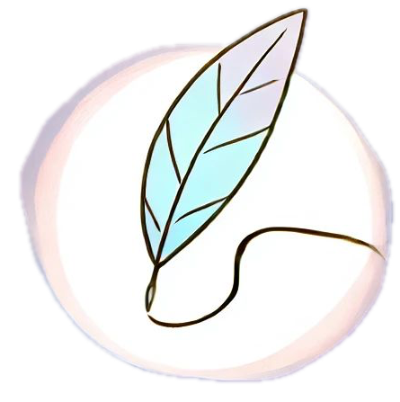
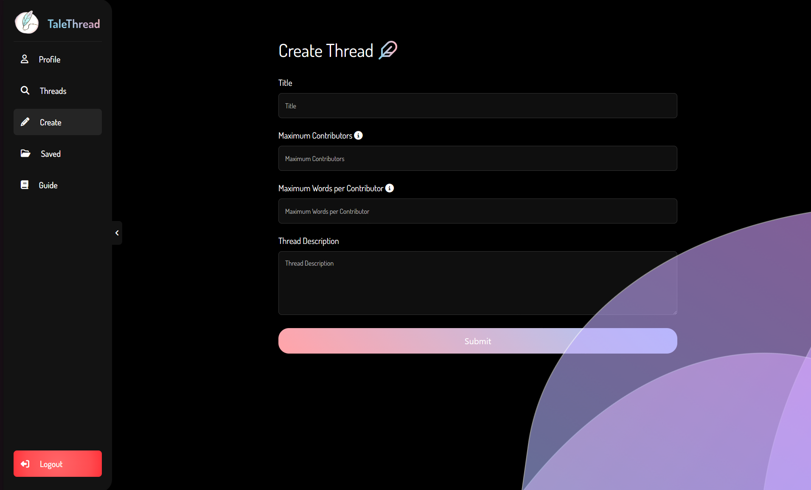
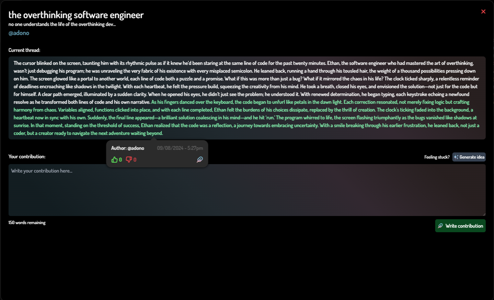

<!-- Improved compatibility of back to top link: See: https://github.com/othneildrew/Best-README-Template/pull/73 -->
<a id="readme-top"></a>
<!--
*** Thanks for checking out the Best-README-Template. If you have a suggestion
*** that would make this better, please fork the repo and create a pull request
*** or simply open an issue with the tag "enhancement".
*** Don't forget to give the project a star!
*** Thanks again! Now go create something AMAZING! :D
-->


<!-- PROJECT SHIELDS -->
<!--
*** I'm using markdown "reference style" links for readability.
*** Reference links are enclosed in brackets [ ] instead of parentheses ( ).
*** See the bottom of this document for the declaration of the reference variables
*** for contributors-url, forks-url, etc. This is an optional, concise syntax you may use.
*** https://www.markdownguide.org/basic-syntax/#reference-style-links
-->
[![Contributors][contributors-shield]][contributors-url]
[![Forks][forks-shield]][forks-url]
[![Stargazers][stars-shield]][stars-url]
[![Issues][issues-shield]][issues-url]
[![MIT License][license-shield]][license-url]


<!-- PROJECT LOGO -->
<br />
<div align="center">
  <a href="https://github.com/self-sasi/talethread">
    
  </a>

<h3 align="center">TaleThread</h3>

  <p align="center">
    Social media app for creative writers.
    <br />
    <a href="https://github.com/self-sasi/TaleThread/blob/main/README.md#about-the-project"><strong>Explore the docs »</strong></a>
    <br />
    <br />
    <!-- <a href="https://uw-acronym-finder.vercel.app">🚀 View Live</a>
    · -->
    <a href="https://github.com/self-sasi/talethread/issues/new?labels=bug&template=bug-report---.md">Report Bug</a>
    ·
    <a href="https://github.com/self-sasi/talethread/issues/new?labels=enhancement&template=feature-request---.md">Request Feature</a>
  </p>
</div>


<!-- TABLE OF CONTENTS -->
<details>
  <summary>Table of Contents</summary>
  <ol>
    <li>
      <a href="#about-the-project">About The Project</a>
      <ul>
        <li><a href="#built-with">Built With</a></li>
      </ul>
    </li>
    <li>
      <a href="#getting-started">Getting Started</a>
      <ul>
        <li><a href="#prerequisites">Prerequisites</a></li>
        <li><a href="#installation">Installation</a></li>
      </ul>
    </li>
    <li><a href="#usage">Usage</a></li>
    <!-- <li><a href="#roadmap">Roadmap</a></li> -->
    <li><a href="#contributing">Contributing</a></li>
    <!-- <li><a href="#license">License</a></li> -->
    <li><a href="#contact">Contact</a></li>
  </ol>
</details>


<!-- ABOUT THE PROJECT -->
## About The Project

[![Product Name Screen Shot][product-screenshot]](https://example.com)

**TaleThread** is a social media application designed to enhance story writing through collaborative features and real-time assistance.

<p align="right">(<a href="#readme-top">back to top</a>)</p>


### Built With

* [![Angular][Angular.io]][Angular-url]
* [![Django][Django Badge]][Django-url]
* [![SQLite][SQLite Badge]][SQLite-url]
* [![Tailwind][Tailwindcss]][Tailwind-url]
* [![GPT API][ChatGPT]][GPT-URL]


<p align="right">(<a href="#readme-top">back to top</a>)</p>


<!-- GETTING STARTED -->
## Getting Started

To get a local copy up and running follow these simple steps.

### Prerequisites


* npm
  ```sh
  npm install npm@latest -g
  ```
* Django REST Framework
  ```sh
  pip install djangorestframework
  ```

### Installation

1. Clone the repo
   ```sh
   git clone https://github.com/self-sasi/talethread.git
   ```
2. API and SQLite db config
    >To use the creative writing AI feature, you will need to insert your own OpenAI API key in a new file named 
    ```backend/.env```. Follow the format in ```backend/.env.example```

    ```sh
    cd backend
    python manage.py makemigrations user_auth
    python manage.py migrate user_auth
    python manage.py makemigrations user_profile
    python manage.py migrate user_profile
    python manage.py makemigrations threads
    python manage.py migrate threads
    ```

    Run the API server
    ```sh
    python manage.py runserver
    ```
3. Frontend config (in a new terminal)
   ```sh
   cd frontend
   npm install
   ng serve
   ```
Application will be running at http://localhost:4200/

<p align="right">(<a href="#readme-top">back to top</a>)</p>


<!-- USAGE EXAMPLES -->
## Usage

1. **Collaborative Story Writing**  
   Create and edit stories collaboratively with other users. Simply start a new story or join an existing one, and collaborate in real-time to develop engaging narratives.  
   

2. **Real-Time Writing Assistance**  
   Receive instant writing suggestions and creative input powered by OpenAI’s GPT-4o API. This feature helps you refine your content and overcome writer’s block efficiently.  
   

3. **User-Friendly Interface**  
   Navigate the application effortlessly with our user-centric interface built using Angular and TailwindCSS.
   


<p align="right">(<a href="#readme-top">back to top</a>)</p>


<!-- ROADMAP -->
<!-- ## Roadmap

- [ ] Feature 1
- [ ] Feature 2
- [ ] Feature 3
    - [ ] Nested Feature

See the [open issues](https://github.com/self-sasi/talethread/issues) for a full list of proposed features (and known issues).

<p align="right">(<a href="#readme-top">back to top</a>)</p> -->


<!-- CONTRIBUTING -->
## Contributing

Contributions are what make the open source community such an amazing place to learn, inspire, and create. Any contributions you make are **greatly appreciated**.

If you have a suggestion that would make this better, please fork the repo and create a pull request. You can also simply open an issue with the tag "enhancement".
Don't forget to give the project a star! Thanks again!

1. Fork the Project
2. Create your Feature Branch (`git checkout -b feature/AmazingFeature`)
3. Commit your Changes (`git commit -m 'Add some AmazingFeature'`)
4. Push to the Branch (`git push origin feature/AmazingFeature`)
5. Open a Pull Request

<p align="right">(<a href="#readme-top">back to top</a>)</p>


<!-- LICENSE -->
<!-- ## License

Distributed under the MIT License. See `LICENSE.txt` for more information.

<p align="right">(<a href="#readme-top">back to top</a>)</p> -->


<!-- CONTACT -->
## Contact

Sarthak Singh - [in/SarthakSingh](https://www.linkedin.com/in/sarthaksingh0512/)  
Adon Ojha - [in/AdonOjha](https://www.linkedin.com/in/adonojha/)  
Kushagra Kapoor - [in/KushagraKapoor](https://www.linkedin.com/in/kushagra-kapoor-223336247/)


<p align="right">(<a href="#readme-top">back to top</a>)</p>


<!-- MARKDOWN LINKS & IMAGES -->
<!-- https://www.markdownguide.org/basic-syntax/#reference-style-links -->
[contributors-shield]: https://img.shields.io/github/contributors/self-sasi/talethread.svg?style=for-the-badge
[contributors-url]: https://github.com/self-sasi/talethread/graphs/contributors
[forks-shield]: https://img.shields.io/github/forks/self-sasi/talethread.svg?style=for-the-badge
[forks-url]: https://github.com/self-sasi/talethread/network/members
[stars-shield]: https://img.shields.io/github/stars/self-sasi/talethread.svg?style=for-the-badge
[stars-url]: https://github.com/self-sasi/talethread/stargazers
[issues-shield]: https://img.shields.io/github/issues/self-sasi/talethread.svg?style=for-the-badge
[issues-url]: https://github.com/self-sasi/talethread/issues
[license-shield]: https://img.shields.io/github/license/self-sasi/talethread.svg?style=for-the-badge
[license-url]: https://github.com/self-sasi/talethread/blob/master/LICENSE.txt
[linkedin-shield]: https://img.shields.io/badge/-LinkedIn-black.svg?style=for-the-badge&logo=linkedin&colorB=555
[product-screenshot]: ./frontend/public/product-screenshot.png
[demo-screenshot]: public/demo.png
[demo-screenshot2]: public/demo2.png
[Next.js]: https://img.shields.io/badge/next.js-000000?style=for-the-badge&logo=nextdotjs&logoColor=white
[Next-url]: https://nextjs.org/
[React.js]: https://img.shields.io/badge/React-20232A?style=for-the-badge&logo=react&logoColor=61DAFB
[React-url]: https://reactjs.org/
[Vue.js]: https://img.shields.io/badge/Vue.js-35495E?style=for-the-badge&logo=vuedotjs&logoColor=4FC08D
[Vue-url]: https://vuejs.org/
[Angular.io]: https://img.shields.io/badge/Angular-DD0031?style=for-the-badge&logo=angular&logoColor=white
[Angular-url]: https://angular.io/
[Svelte.dev]: https://img.shields.io/badge/Svelte-4A4A55?style=for-the-badge&logo=svelte&logoColor=FF3E00
[Svelte-url]: https://svelte.dev/
[Laravel.com]: https://img.shields.io/badge/Laravel-FF2D20?style=for-the-badge&logo=laravel&logoColor=white
[Laravel-url]: https://laravel.com
[Bootstrap.com]: https://img.shields.io/badge/Bootstrap-563D7C?style=for-the-badge&logo=bootstrap&logoColor=white
[Bootstrap-url]: https://getbootstrap.com
[JQuery.com]: https://img.shields.io/badge/jQuery-0769AD?style=for-the-badge&logo=jquery&logoColor=white
[JQuery-url]: https://jquery.com 
[Tailwindcss]: https://img.shields.io/badge/tailwind-161D2D?style=for-the-badge&logo=tailwindcss&logoColor=16BECB
[Tailwind-url]: https://tailwindcss.com 
[Django Badge]: https://img.shields.io/badge/Django-092E20?logo=django&logoColor=fff&style=for-the-badge
[Django-url]: https://www.djangoproject.com/
[SQLite Badge]: https://img.shields.io/badge/SQLite-003B57?logo=sqlite&logoColor=fff&style=for-the-badge
[SQLite-url]: https://sqlite.org
[ChatGPT]: https://img.shields.io/badge/chatGPT-74aa9c?style=for-the-badge&logo=openai&logoColor=white
[GPT-url]: https://openai.com/index/openai-api/